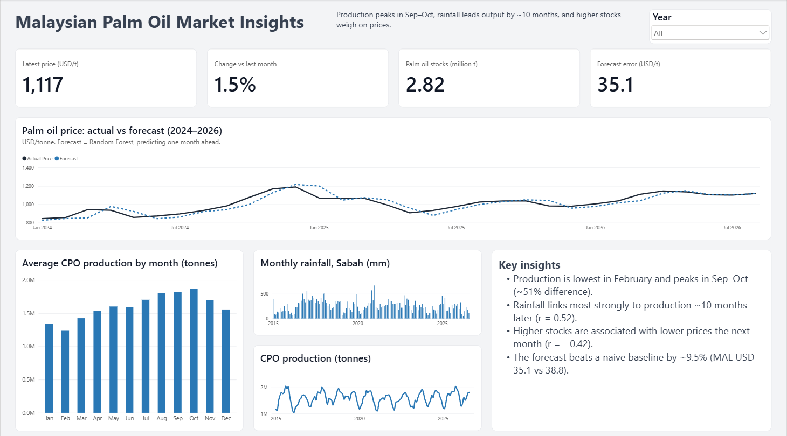
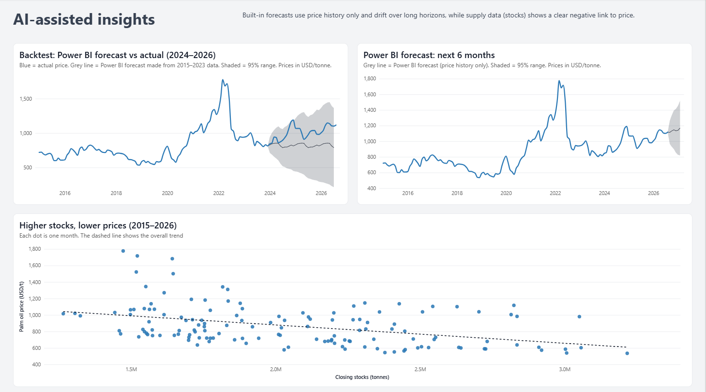

# Malaysian Palm Oil Price & Production Insights

An end-to-end data project that combines palm oil prices, Malaysian production and stock data, and rainfall to answer two questions:

1. **What drives Malaysian palm oil supply and prices?**
2. **Can next month's palm oil price be forecast better than a simple baseline?**

Built with Python (pandas, scikit-learn), Azure Blob Storage, GitHub Actions and Power BI. The dataset refreshes automatically every month.



---

## Key findings

| # | Finding | Evidence |
|---|---------|----------|
| 1 | **Strong seasonality:** crude palm oil (CPO) production is lowest in February and peaks in September–October | Peak month is ~51% higher than the lowest month (2015–2026 average) |
| 2 | **Rainfall acts with a delay:** production is most strongly linked to rainfall about **10 months earlier** | r = 0.52 at a 10-month lag (part of this may reflect shared seasonality) |
| 3 | **Stocks weigh on prices:** higher closing stocks are associated with lower prices the following month | r = −0.42 |
| 4 | **Forecasting:** a Random Forest predicting monthly price changes beats a naive baseline by **~9.5%** | MAE USD 35.1 vs 38.8 per tonne (2024–2026 test period) |

---

## Forecast results

The model predicts **next month's price change** using only information available at the time (last month's price change, stock level and change, production, and rainfall lagged 10 months). The data was split by time: trained on **2015–2023 (98 months)** and tested on **Jan 2024 – Aug 2026 (32 months)** that the model never saw.

| Model | MAE (USD/tonne) | vs naive baseline |
|-------|-----------------|-------------------|
| Naive baseline (next month = this month) | 38.8 | – |
| Linear Regression | 35.8 | 7.7% better |
| **Random Forest** | **35.1** | **9.5% better** |

**Interpretation:** the improvement is real but modest, as expected for commodity prices, which are driven by many global factors not in this dataset (e.g. crude oil prices, soybean oil, export policies, the 2022 supply shock).

**Built-in forecast comparison:** Power BI's forecast (exponential smoothing on price history only), backtested over the same period by predicting all 32 months at once, drifted well below actual prices as they rose in 2025–2026. This shows the value of supply-side features and why forecast horizon matters.



---

## Architecture

```
 Sources                      Azure Blob Storage (palm-oil-data)          Reporting
 ───────                      ──────────────────────────────────          ─────────
 World Bank Pink Sheet ──┐
 MPOB CSV + backfill ────┼──► raw/
                         │      │
 Open-Meteo API ─────────┤      ▼
                         └──► GitHub Actions (12th monthly)
                                pipeline/refresh_data.py
                                │  clean · merge · backfill
                                ▼
                              processed/palm_oil_monthly.csv ──────────► Power BI
                                                                         dashboard
 Colab notebook ───────────► processed/forecast.csv ─────────────────► (2 pages)
 (analysis + models)
```

- **Storage:** Azure Blob Storage with a `raw/` (source files) and `processed/` (analysis-ready) layout.
- **Automation:** a scheduled GitHub Actions workflow runs `pipeline/refresh_data.py` on the 12th of every month (after MPOB's monthly release), fetches fresh rainfall from Open-Meteo, rebuilds the dataset and writes it back to Blob Storage. It can also be run manually.
- **Analysis and modelling:** the Colab notebook explores the data, trains the forecast models and uploads `forecast.csv` to Blob Storage.
- **Reporting:** Power BI reads both files directly from Azure, so a refresh shows the latest month.
- **Security:** the storage connection string is kept in an encrypted GitHub secret and in Colab Secrets, never in the code.

---

## Approach

1. **Data collection and cleaning:** load the World Bank Pink Sheet, locate the header row programmatically, convert `2015M01`-style dates, aggregate daily rainfall to monthly totals, and reshape MPOB data from long to wide format.
2. **Data quality:** the MPOB production series had **76 missing months**. These were backfilled from MPOB's official yearly *Summary of the Malaysian Palm Oil Industry* reports (2015–2020), the Ministry of Plantation and Commodities' *Palm Oil Statistics 2023* (2022), and MPOB monthly report figures (2023). The backfill was validated against MPOB's closing stocks (exact match) and official annual production totals (2022 exact; 2023 within 0.01%).
3. **Analysis:** seasonality by calendar month, lagged correlation between rainfall and production (0–12 months), and stocks vs next month's price.
4. **Forecasting:** feature engineering using only past information (no data leakage), a time-based train/test split, and comparison of three models by mean absolute error.
5. **Dashboard:** a two-page Power BI report with DAX measures (latest price, month-on-month change, stocks, forecast error), a year filter, a forecast backtest, and a stocks-vs-price trend line.
6. **Cloud storage and automation:** processed data is stored in Azure Blob Storage, and a scheduled GitHub Actions workflow refreshes it monthly. Power BI connects directly to the cloud source.

---

## Data sources

| Data | Source | Frequency |
|------|--------|-----------|
| Palm oil price (USD/tonne) | [World Bank Commodity Markets (Pink Sheet)](https://www.worldbank.org/en/research/commodity-markets) | Monthly |
| CPO production and palm oil closing stocks | Malaysian Palm Oil Board (MPOB), via [palmoileconomics.com](https://palmoileconomics.com/data/mpob), backfilled from [MPOB](https://bepi.mpob.gov.my/) and [KPK](https://www.kpk.gov.my/) reports | Monthly |
| Rainfall, Sandakan, Sabah | [Open-Meteo Historical Weather API](https://open-meteo.com/) | Daily, aggregated to monthly |

---

## Repository structure

```
palm-oil-insights/
├── README.md
├── palm_oil_project.ipynb          # data pipeline, analysis and forecasting
├── .github/workflows/
│   └── monthly-refresh.yml         # scheduled GitHub Actions workflow (12th of each month)
├── pipeline/
│   ├── refresh_data.py             # monthly refresh: raw/ → processed/ in Azure Blob Storage
│   └── requirements.txt
├── data/
│   ├── CMO-Historical-Data-Monthly.xlsx
│   ├── mpob_raw.csv
│   ├── production_backfill.csv
│   ├── mpob_production.csv
│   ├── palm_oil_prices_and_rainfall.csv
│   ├── palm_oil_monthly.csv        # final clean dataset
│   └── forecast.csv                # model predictions for 2024–2026
└── dashboard/
    ├── palm_oil_dashboard.pbix
    ├── palm_oil_theme_fhd_dark_text.json
    ├── dashboard_overview.png
    └── dashboard_ai_insights.png
```

---

## How to run

1. Open `palm_oil_project.ipynb` in [Google Colab](https://colab.research.google.com/) (use the **Open in Colab** badge at the top of the notebook).
2. Upload the files from `data/` to your Google Drive folder, or update the `folder` path in the notebook.
3. Run all cells (**Runtime → Run all**).
4. Open `dashboard/palm_oil_dashboard.pbix` in Power BI Desktop (Windows). It reads from Azure Blob Storage, so you will need your own storage account and access key, or you can point the queries back to the CSV files in `data/`.

**Automated refresh (GitHub Actions)**

1. Create an Azure storage account with a container named `palm-oil-data`, and upload the source files to `raw/`.
2. Add the storage connection string as a repository secret named `AZURE_CONN_STR` (**Settings → Secrets and variables → Actions**).
3. The workflow runs automatically on the 12th of each month, or manually from **Actions → Monthly data refresh → Run workflow**.
4. Each month, upload the latest World Bank Pink Sheet and MPOB file to `raw/` before the 12th.

---

## Limitations

- **Short test period:** 32 months, so results may change with more data.
- **Correlation, not causation:** the rainfall lag may partly reflect shared seasonal patterns.
- **Missing global drivers:** crude oil prices, competing vegetable oils, exchange rates and export policies are not included.
- **Single rainfall location:** Sandakan represents one major palm oil region, not all of Malaysia.

## Next steps

- Benchmark the Random Forest against **Azure Machine Learning AutoML** on the same test period
- Automate the model retraining step, so `forecast.csv` also refreshes monthly
- Add external drivers such as crude oil and soybean oil prices

---

## Tech stack

Python (pandas, scikit-learn, matplotlib) · Google Colab · Azure Blob Storage · GitHub Actions · Power BI (DAX, Power Query) · GitHub

## Author

**Ahmad Isyraf** · [LinkedIn](https://linkedin.com/in/ahmad-isyraf/) · [GitHub](https://github.com/ahmadisyraf39)
